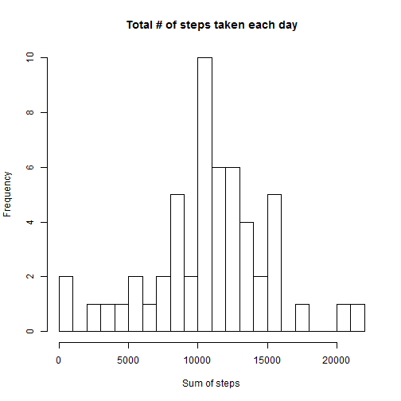
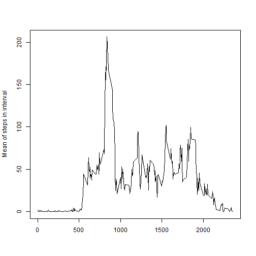
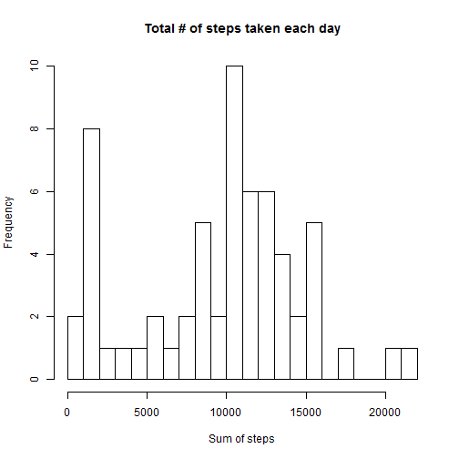
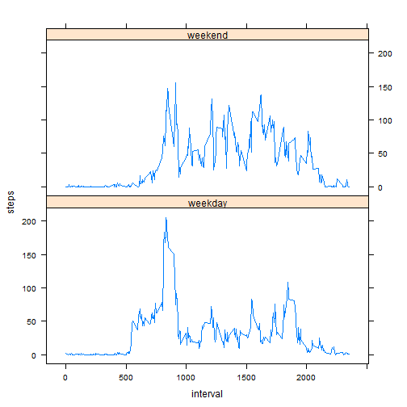

## Loading and preprocessing the data

```r
activity <- read.csv(unzip("./activity.zip"))
```

## What is mean total number of steps taken per day?
Note: NA values in dataset are ignored, as per the default na.action in func aggregate.

### 1. Calculate the total number of steps taken per day

```r
(sumSteps <- aggregate(data=activity, steps~date, FUN=sum))
```

```
##          date steps
## 1  2012-10-02   126
## 2  2012-10-03 11352
## 3  2012-10-04 12116
## 4  2012-10-05 13294
## 5  2012-10-06 15420
## 6  2012-10-07 11015
## 7  2012-10-09 12811
## 8  2012-10-10  9900
## 9  2012-10-11 10304
## 10 2012-10-12 17382
## 11 2012-10-13 12426
## 12 2012-10-14 15098
## 13 2012-10-15 10139
## 14 2012-10-16 15084
## 15 2012-10-17 13452
## 16 2012-10-18 10056
## 17 2012-10-19 11829
## 18 2012-10-20 10395
## 19 2012-10-21  8821
## 20 2012-10-22 13460
## 21 2012-10-23  8918
## 22 2012-10-24  8355
## 23 2012-10-25  2492
## 24 2012-10-26  6778
## 25 2012-10-27 10119
## 26 2012-10-28 11458
## 27 2012-10-29  5018
## 28 2012-10-30  9819
## 29 2012-10-31 15414
## 30 2012-11-02 10600
## 31 2012-11-03 10571
## 32 2012-11-05 10439
## 33 2012-11-06  8334
## 34 2012-11-07 12883
## 35 2012-11-08  3219
## 36 2012-11-11 12608
## 37 2012-11-12 10765
## 38 2012-11-13  7336
## 39 2012-11-15    41
## 40 2012-11-16  5441
## 41 2012-11-17 14339
## 42 2012-11-18 15110
## 43 2012-11-19  8841
## 44 2012-11-20  4472
## 45 2012-11-21 12787
## 46 2012-11-22 20427
## 47 2012-11-23 21194
## 48 2012-11-24 14478
## 49 2012-11-25 11834
## 50 2012-11-26 11162
## 51 2012-11-27 13646
## 52 2012-11-28 10183
## 53 2012-11-29  7047
```

### 2. Make a histogram of the total number of steps taken each day

```r
# split dataset into subsets by column date, and sum up step variable in each subset (i.e. day)
hist(sumSteps$steps, breaks = 25, main = "Total # of steps taken each day", xlab = "Sum of steps")
```

 

### 3. Calculate and report the mean and median of the total number of steps taken per day
Note: Interpret this question as asking to take mean and median across all 58 days (NA excluded), i.e. 1 mean value and 1 median value for the 2 months.

```r
mean(sumSteps$steps)
```

```
## [1] 10766.19
```

```r
median(sumSteps$steps)
```

```
## [1] 10765
```

## What is the average daily activity pattern?

1. Make a time series plot (i.e. type = "l") of the 5-minute interval (x-axis) and the average number of steps taken, averaged across all days (y-axis)


```r
library(plyr) 
library(dplyr)
aggregate(data=activity, steps~interval, FUN=mean) %>%
with(., {
        plot(interval,y=steps, xlab="", ylab = "Mean of steps in interval", type="l")
    })    
```

 

2. Which 5-minute interval, on average across all the days in the dataset, contains the maximum number of steps?

```r
aggregate(data=activity, steps~interval, FUN=mean) %>%
.[order(.$steps),] %>%  #sort in ascending order of steps
tail(n=1)
```

```
##     interval    steps
## 104      835 206.1698
```

## Imputing missing values

1. Calculate and report the total number of missing values in the dataset (i.e. the total number of rows with NAs)   

```r
sum(is.na.data.frame(activity))
```

```
## [1] 2304
```

2. Fill in the missing values in the dataset with the median of steps for the same  interval,

3. and save this in a new dataset, activity2.

```r
# func to replace x (if NA) with the median of the values in the split subset) 
impute.median <- function(x) replace(x, is.na(x), median(x, na.rm = TRUE))

# ddply subsets activity by interval,  transforms activity by applying func impute.median  
activity2 <- ddply(activity, ~interval, transform, steps = impute.median(steps))

#Reorder activity2 by date as plyr orders by group
activity2 <- activity2[order(activity2$date, activity2$interval), ] 
```


4. Make a histogram of the total number of steps taken each day with the new dataset, activity2

```r
sumSteps <- aggregate(data=activity2, steps~date, FUN=sum)
hist(sumSteps$steps, breaks = 25, main = "Total # of steps taken each day", xlab = "Sum of steps")
```

 

Calculate and report the mean & median of total number of steps taken per day with the new dataset, activity2.
Note: Same as above, taking  mean and median across all 58 days (NA excluded), i.e. 1 mean value and 1 median value for the 2 months.


```r
mean(sumSteps$steps)
```

```
## [1] 9503.869
```

```r
median(sumSteps$steps)
```

```
## [1] 10395
```

The values differ from the estimates in the first part of the assigment.

1. There are 8 days with NA values for all the 288 5-min intervals in the original dataset 

```r
t1 <- table(activity[is.na.data.frame(activity), "date"])
NA_dates <- dimnames(t1[t1!=0])
NA_dates[[1]]
```

```
## [1] "2012-10-01" "2012-10-08" "2012-11-01" "2012-11-04" "2012-11-09"
## [6] "2012-11-10" "2012-11-14" "2012-11-30"
```
2. These 8 days have 1141 as total no. steps per day, and are now included in the histogram under the 1000-2000 bin.     

```r
sumSteps[sumSteps$date %in% NA_dates[[1]], ]
```

```
##          date steps
## 1  2012-10-01  1141
## 8  2012-10-08  1141
## 32 2012-11-01  1141
## 35 2012-11-04  1141
## 40 2012-11-09  1141
## 41 2012-11-10  1141
## 45 2012-11-14  1141
## 61 2012-11-30  1141
```

3. With these 8 days included, the mean and median of the total no. of steps per day are lower than in the first part of the assignment.   

## Are there differences in activity patterns between weekdays and weekends?

Create a new factor variable "dayType" in the "activity2" dataset with two levels – “weekday” and “weekend” indicating whether a given date is a weekday or weekend day.

```r
activity2$dayType <- as.factor( ifelse(weekdays(as.Date(activity2$date)) %in% c("Saturday","Sunday"), "weekend", "weekday") )
```

Make a panel plot containing a time series plot (i.e. type = "l") of the 5-minute interval (x-axis) and the average number of steps taken, averaged across all weekday days or weekend days (y-axis). 

```r
library(lattice)
aggregate(data=activity2, steps~interval*dayType, FUN=mean) %>%
xyplot(steps ~ interval | dayType, data = . , layout = c(1, 2), type="l")
```

 

The above plot shows differences in activity patterns between weekdays and weekend.   
1. During weekends, mean step values were generally higher (indicating higher activity levels) from interval 500 to interval 2000.   
2. The max mean step value is observed at the interval 835 on weekdays.

--- End of Report ---

```r
sessionInfo()
```

```
## R version 3.1.2 (2014-10-31)
## Platform: x86_64-w64-mingw32/x64 (64-bit)
## 
## locale:
## [1] LC_COLLATE=English_United States.1252 
## [2] LC_CTYPE=English_United States.1252   
## [3] LC_MONETARY=English_United States.1252
## [4] LC_NUMERIC=C                          
## [5] LC_TIME=English_United States.1252    
## 
## attached base packages:
## [1] stats     graphics  grDevices utils     datasets  methods   base     
## 
## other attached packages:
## [1] lattice_0.20-29 dplyr_0.4.1     plyr_1.8.1      knitr_1.10     
## 
## loaded via a namespace (and not attached):
##  [1] assertthat_0.1   DBI_0.3.1        digest_0.6.8     evaluate_0.7    
##  [5] grid_3.1.2       htmltools_0.2.6  magrittr_1.5     markdown_0.7.4  
##  [9] mime_0.2         parallel_3.1.2   Rcpp_0.11.5      rmarkdown_0.3.11
## [13] stringr_0.6.2    tools_3.1.2      yaml_2.1.13
```
